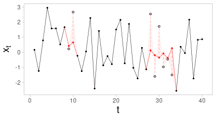
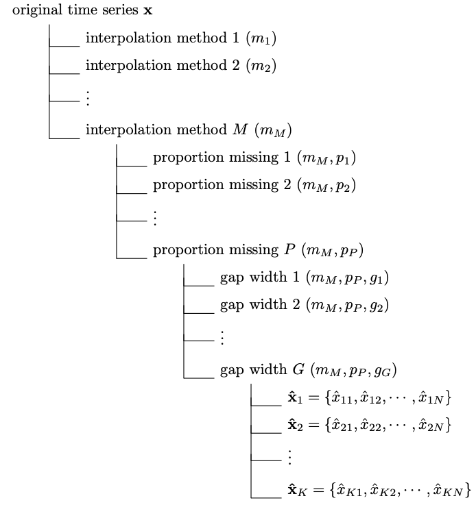
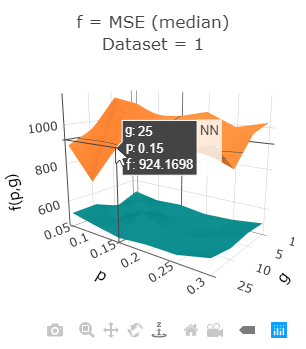
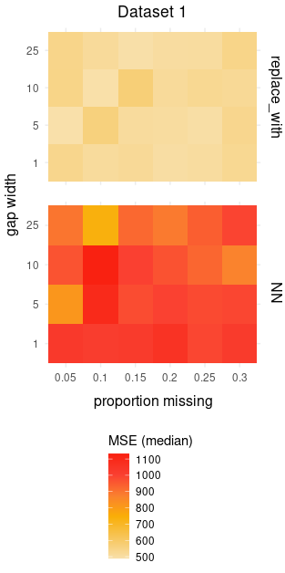
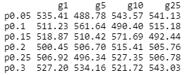
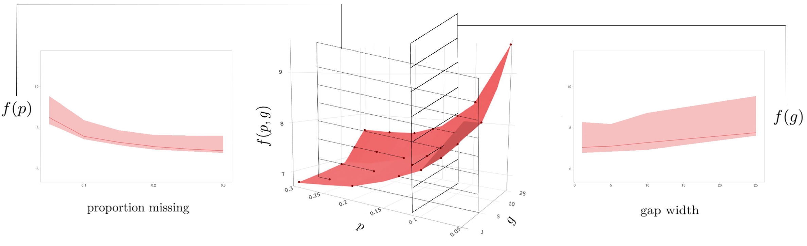
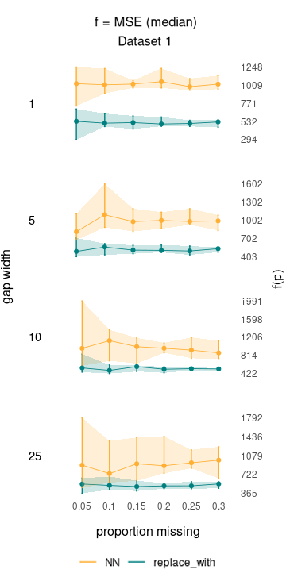

# Summary

The R package `interpTools` provides a means of simulating artificial time series, imposing missing observations according to a specified gap structure, and repairing the incomplete series via __interpolation__, with additional tools for generating data visualizations that describe an interpolator's statistical performance.

# Statement of need

A significant practical challenge when determining the effectiveness of a given interpolator on a particular time series is that the *true* value of a missing data point at a given index of a stochastic time-ordered process, is generally unknown. Performance metrics, such as those described in @lepot2017interpolation typically assume the form:
\begin{equation}
    C(\hat{x}_i, x_i) = C(\hat{x}_i - x_i),\hspace{0.2cm}i = 1,...,I
\end{equation}
where $C$ is some function of the deviation between the interpolated data point, $\hat{x}_i$, and the true data point, $x_i$.  Evidently, without knowing $x_i$, it is impossible to determine such a measure of accuracy, at least in this regard.

<div style="float:right;margin:10px 10px 10px 0" markdown="1">

</div>

To add, the statistical performance of a time series interpolator seems to depend greatly on the __structural nuances of the dataset of interest__.  For example, some are better suited for time series with a high number of embedded periodicities, like the (), whereas others may be more suitable for low-frequency or noisy data, like the (). As the adage goes: "*interpolation is an art, not a science*'', which means to say that no method is necessarily superior to another, at least for time series exhibiting any number of interesting or unusual features.

Further to this problem, an interpolator's performance seems to depend also on the __particular pattern of missing values__ present in the data. For example, it has been shown in @castel2020framework that cubic splines fail exponentially as the gap width increases.  Other methods, such as the Hybrid Wiener Interpolator in @burr2012air, are more resilient to longer sequences of consecutive missing observations.  Still, there are perks and trade-offs to each method, and so careful consideration of the research objectives and parameters of the study should be the first step in the selection of an interpolator in any practical setting.

# `interpTools` Framework

## Generating Artificial Time Series
The `interpTools` package allows a technician to simulate a 'mock' time series containing similar features to a real-world dataset of interest, such that the original data points are known, and performance metrics of the form $C(X_i,x_i)$ can be calculated, following the application of a specified pattern of gaps and a particular interpolation algorithm. Using simulated data enables the user to benchmark performance and make an informed choice regarding which interpolator would be most suitable for use on similar time series outside of the laboratory setting.

A time series, $x_t$, is simulated based on the additive model:
\begin{equation}\label{eq:xt}
 x_t = m_t + t_t + \xi_t
\end{equation}
where $m_t$ is the mean function, $t_t$ is the trend function, and $\xi_t$ is the noise function. The following section provides a brief description of each component, along with its set of defining parameters.

### The mean component, $m_t$
The __mean__ component, $m_t$, is comprised of a constant, non-varying mean element (a 'grand mean'), $\mu$, and a varying polynomial trend element, $\mu_t$:
\begin{equation}
  m_t = \mu +\mu_t, \hspace{1cm}t=1,...,N.
\end{equation}
The `simMt()` function in the `interpTools` package assumes a polynomial of the form:
\begin{equation}
 \mu_t = \sum_{i=1}^\phi a_i \left(\frac{t-c_i}{N}\right)^i
\end{equation}
where $\mu \sim U(\frac{-N}{100},\frac{N}{100})$, and $\textbf{a} = \left[a_1,a_2,...,a_\phi\right]$ with $a_i \sim N(0,\frac{N}{20i})$, are randomly sampled (unless otherwise specified).  The vector $\textbf{c} = \left[c_1, c_2, c_3,...,c_\phi\right]$ is a vector of centering parameters, and unless otherwise specified, is randomly sampled from $1,...,N$ and is fixed $\forall i\in1,...,\phi$.

The function is implemented via the following command:
```{r}
simMt(N, numTrend, a, center, mu)
```

where the user can specify the number of trends, i.e., the degree of the polynomial, $\phi$, the corresponding polynomial coefficients and centering parameters, the grand mean, and the resolution, $N$. A summary of the features of the mean component is shown in Table \ref{tab:mt}.

### The trend component, $t_t$
The __trend__ component, $t_t$, is considered to be a finite linear combination of sinusoids.  The `interpTools` package simulates the trend component according to the construction:
\begin{equation}
    t_t = \sum_{i=1}^{\psi} b_i \sin(\omega_it)
\end{equation}
where $\textbf{b} = \left[b_1,b_2,...,b_\psi\right]$ with $b_i \sim N(1,\frac{N}{200})$ and $\omega = \left[\omega_1,\omega_2,...,\omega_\psi\right]$ where $\omega_i$ defines the period of the $i$th sinusoid. The default is to sample $\psi$ unique values for each $\omega_i \in \left[\frac{2\pi}{N},\pi \right]$, where $\frac{2\pi}{n}$ is the __fundamental Fourier frequency__ and $\pi$ is the __Nyquist frequency__. The frequency is related to the period $\omega$ through the relation:
\begin{equation}
    f = \frac{\omega}{2\pi}.
\end{equation}
Thus, the lowest possible frequency that could be sampled is $f = \frac{\frac{2\pi}{N}}{2\pi} = \frac{1}{N}$, and the highest possible frequency is $f = \frac{\pi}{2\pi} = \frac{1}{2}$.

There is an additional parameter, $\eta$, that defines a bandwidth of the order $10^{-\eta}$ from which to sample $\omega$ from $\frac{\psi}{2}$ random non-overlapping subintervals in the interval $\left[\frac{2\pi}{N},\pi \right]$. For bandwidth-specified simulations, two $\omega$'s are sampled from each subinterval, and so for this reason $\psi$ must be an even integer. 

The simulation of the trend component is facilitated using the `simTt()` function with the following command:
```{r}
simTt(N, numFreq, bandwidth, b)
```
Table \ref{tab:tt} provides a summary  of each parameter.

### The noise component, $\xi_t$
The noise component $\xi_t$ is assumed to be an $ARIMA(P,Q)$ stochastic process:

\begin{equation}
    \xi_t = \alpha_1 X_{t-1} + ... + \alpha_P X_{t-P} + Z_t + \beta_1Z_{t-1} + ... + \beta_Q Z_{t-Q},
\end{equation}

with variance $\sigma^2_{\xi_t}$, where $P$ is the autoregressive (AR) order, and $Q$ is the moving-average (MA) order. 

The `simWt()` function uses the functionality of `arima.sim()` from the `stats` R package to generate a noise sequence, via the command:

```{r}
simWt(N, p, q, var)
```

where the user must specify the resolution, the autoregressive order, moving average order, and the variance of the process. Table \ref{tab:wt} provides a description of each parameter.

The components of $x_t$ can be simulated individually with `simMt()`, `simTt()`, and `simWt()`, and then added together according to Equation \ref{eq:xt}. Or, the `simXt()` wrapper function can be used.  Information about the features of each component, such as the polynomial equation of $m_t$, or the exact frequencies contained in $t_t$, are saved to memory in list objects of class `"simList"`. The actual numeric observations defining $x_t$ can be accessed as follows:

```{r}
Xt <- simXt()$Xt
```

## Imposing a gap structure
Once the artificial data has been generated, the user can remove observations according to a gap structure defined by parameters $p$, the proportion of data missing, and $g$, the gap width, where each observation (except the endpoints) has the same Bernoulli probability of missingness, $p_\text{omit} = 1/(N-2)$. 

The result is a 'gappy' series with a total of $I=p\cdot N$ missing observations, appearing structurally as $\leq\frac{p\cdot N}{g}$ randomly-spaced non-overlapping holes of width $g$, where a `hole' is defined as a sequence of adjacent missing observations. Note that since holes may be placed adjacent to one another, this quantity describes the number of holes visible, *at most*. 

<div style="float:left;margin:10px 10px 10px 0" markdown="1">

</div>

For example, consider a complete time series of length $N = 40$. Setting $p=0.10$ and $g=1$ implies a gap structure whereby 10\% of the original data points are removed at random for a total of $I=0.10\cdot40 = 4$ missing observations, appearing as $\leq0.10\cdot40/1 = 4$ holes with width 1. An example of this particular missingness scenario is provided in Figure \ref{fig:gapWidths}b. Note that there are 9 visible holes, since missing values 96 and 97 are placed adjacent to one another. Compare this to a gap structure defined by $p=0.10$ and $g=10$, where the total number of missing observations is the same, but now there is only $I=0.10\cdot40/10 = 1$ hole (Figure \ref{fig:gapWidths}c).

The function used to remove gaps in this fashion is `simulateGaps()`, represented below:

```{r}
simulateGaps(data, prop_vec, gap_vec, K)
```

where $K$ is the number of unique `gappy' series to derive from the `complete' series, according to a particular $(p,g)$ specification. If $p$ and $g$ are vectors of length $P$ and $G$, respectively, then a nested list of dimension $P \times G \times K$ is returned, where there are $K$ gappy series of length $N$ for each $(p,g)$ combination.

In the current version of `interpTools`, the gap-generating algorithm is restricted to the situation where the observations are Missing Completely at Random (MCAR). Of course, it is entirely possible that some other nonuniform probability distribution of missing values may arise in practice, where observations are more or less likely to be omitted at certain times, i.e., $p_\text{omit} = f(t)$, with $f$ a function of time. This is a feature that we would like to develop in future versions of `interpTools`.

## Performing interpolation
The next step is to interpolate the large nested list of gappy data using `parInterpolate()`, which utilizes the functionality of the R package `parallel` to perform the interpolations in parallel, for efficiency. Table \ref{tab:algorithm_names} shows a list of interpolation algorithms built-in to `interpTools`, though a user may also choose input their own algorithm. 

The output of `parInterpolate()` is a nested list of dimension $M \times P \times G \times K$. Figure \ref{fig:schematic} provides a schematic of this nested list object, and Table \ref{tab:parameters} describes each dimension parameter. Note that every combination of ($m,p,g$) will have a list of $K$ interpolated time series of length $N$, where each $\mathbf{\hat{x}}_k$ for $k = 1,...K$ approximates the original time series, $\mathbf{x}$.




# A toy example
## Data simulation and imposing gaps
We start by simulating a simple artificial time series containing a cubic mean component and 40 embedded periodic trends against a background of white noise:

```{r}
# generating mean component
mt <- simMt(N = 1000, numTrend = 3)$value

# generating trend component 
tt <- simTt(N = 1000, numFreq = 40)$value

# generating noise component
wt <- simWt(N = 1000, p = 0, q = 0)$value

# combining
xt <- mt + tt + wt
```

Next, we specify two vectors, `p` and `g`, that contain the possible values of proportion missing and gap width, respectively.  

```{r}
p <- c(0.05, 0.10, 0.15, 0.20, 0.25, 0.30)
g <- c(1, 5, 10, 25)
```
where $P = 6$ and $G = 4$.

Parameterized by all $P \times G = 24$ combinations of $(p,g)$, each of the gap specifications are imposed $K=10$ times onto `xt` in the next step:

```{r}
xt_g <- simulateGaps(data = xt, 
                     prop_vec = p, gap_vec = g, 
                     K = 10)
```

## Interpolation
Now, derived from `xt`, we have $P \times G \times K = 240$ gappy series of length $N = 1000$, contained in `xt_g`, ready for the interpolation step. In this toy example, we will demonstrate the usage of `parInterpolate()` for the simultaneous interpolation of each gappy series using both a built-in algorithm, and one that we will create from scratch. 

### Building a toy interpolation algorithm
In addition to the myriad of interpolation algorithms built-in to `parInterpolate()` (listed in Table \ref{tab:algorithm_names}), the user may also use any number of their own defined functions. Here, we define a toy interpolation algorithm, `replace_with()`, which will replace each missing observation in a gap with a value specified by `num`:

```{r}
replace_with <- function(x, num){
  
  stopifnot(is.numeric(x), is.numeric(num))
  
  x_int <- x
  x_int[which(is.na(x))] <- num
  
  if(!any(is.na(x_int))){
  return(x_int)
  }
  
  else{
    stop("Interpolated series still 
    contains missing values.")
  }
}
```

Of course, we do not expect this method to perform well at all, but this is not the intention of the exercise. No matter how complicated the algorithm, `parInterpolate()` requires that it contain an argument for passing in a single gappy numeric vector, and culminate in the return of a single interpolated numeric vector.

Proceeding to the interpolation step, we will choose the built-in Hybrid Wieiner Interpolator (HWI) and our user-defined interpolator by setting `methods` and `FUN_CALL`:

```{r}
xt_i <- parInterpolate(
       GappyData = xt_g, 
       methods = c("HWI"), 
       FUN_CALL = c("replace_with(num = 5, x = "), 
       numCores = detectCores(), parallel = "k"
       )
```

Note that the user can specify the number of cores to use via `numCores`, and choose from `"p"`, `"g"` or `"k"` to pass into `parallel`, which will set the index over which to parallelize the interpolation of the nested list of gappy time series, `GappyData`. 

The resulting output is the nested list object described in Figure \ref{fig:schematic}, which has dimension $M \times P \times G \times K$.

## Evaluating Statistical Performance
Recall that our definition of statistical performance at any time index is given by some function of the deviation, $C$. Generally speaking, $C$ quantifies how well the interpolated series, $\mathbf{\hat{x}} = \left\{\hat{x}_t\right\}_{t=0}^{N-1}$, captures the essence of the original series,  $\mathbf{x} = \left\{x_t\right\}_{t=0}^{N-1}$. The `interpTools` package contains 18 such performance metrics (details of which are shown in Table \ref{tab:metrics}). 

For every $(\mathbf{x},\mathbf{\hat{x}})$ pair, statistical performance can be calculated via the function `performance()`: 

```{r}
pf <- performance(OriginalList = list(xt), 
                     GappyList = list(xt_g), 
                     IntList = list(xt_i))
```

The resulting output is another list of class `"pf"`, and of dimension $M \times P \times G \times K$, where the terminal node is a vector of the 18 built-in performance criteria. Consider that for any $(m,p,g)$ branch, there are a set of $K$ values for each criterion. Thus, each performance metric has a sampling distribution containing $K$ elements. The performance matrices can be condensed by aggregating sample statistics over $K$ to reduce dimensionality, via the function `agEvaluate()`:

```{r}
agEval <- agEvaluate(pf = pf)
```

As a visual example, imagine a path through Figure \ref{fig:schematic}, where $p = 15\%$, $g = 10$, and $m = $ HWI, such that we end with a collection $\left\{\mathbf{\hat{x}}_k: k\in1,...,K\right\}$ (Figure \ref{fig:path}a). Now, imagine applying some performance metric formula, say, $C = $ MSE (Appendix \ref{tab:metrics}), to each $\left(\mathbf{\hat{x}_k},\mathbf{x}_k\right)$ pair, such that we have a collection of $K$ values, $\left\{C_k\left(\mathbf{\hat{x}},\mathbf{x}_k\right): k\in1,...,K\right\}$.  The sampling distribution of $\left\{C_k\right\}$ is shown in Figure \ref{fig:path}b. Now suppose a sample statistic $f$, for example, the sample median, is calculated for this distribution, such that $f = \text{median}\left(\left\{C_k, k\in1,..,K\right\}\right)$ (Figure \ref{fig:path}b).  This value represents the aggregated (median) performance of the HWI for a gap structure of ($p = 15\%$, $g = 10$), denoted by the value $f(15\%,10)$ (indicated in Figure \ref{fig:path}c).

![a) Set of $K$ HWI interpolations, $\left\{\mathbf{\hat{x}}_k: k\in1,...,K\right\}$, under the gap specification $(p,g) = (15\%,10)$, and the performance metrics $\left\{C_k\left(\mathbf{\hat{x}},\mathbf{x}_k\right): k\in1,...,K\right\}$, where $C = $MSE.<br>
    b) Example sampling distribution of $\left\{C_k : k\in1,...,K\right\}$, where $f = \text{median}\left(\left\{C_k, k\in1,..,K\right\}\right)$.<br>
    c) An example surface plot over $(\mathbf{p},\mathbf{g})$ of $\left\{f(p,g): p = 1,...,P, g\in1,...G\right\}$, indicating the aggregated performance at $(p,g) = (15\%,10)$.\label{fig:path}](path.jpg)

The sample statistics that are offered in this package are listed below:
\begin{itemize}
    \item mean
    \item standard deviation
    \item 0\% quantile (minimum)
    \item 2.5\% quantile
    \item 25\% quantile
    \item 50\% quantile (median)
    \item 75\% quantile
    \item 97.5\% quantile
    \item 100\% quantile (maximum)
    \item IQR (75\% quantile - 25\% quantile)
    \item skewness
    \item p-value of dip test for unimodality (via `diptest`)
\end{itemize}

## Data Visualization
### 3D Surfaces
Considering the full set of possible gap combinations $\left\{(p_i,g_j): i\in1,...,P, j\in1,...,G\right\}$ as a discrete mesh in $\mathcal{R}^3$, mapping these aggregated statistics traces out a __surface__ $f(p,g)$, where the height of the surface at a point $(p,g)$ represents an interpolator’s aggregated performance when subjected to a specific proportion of data missing and gap width.  Visualizing performance as a surface helps a technician to understand the behaviour of an interpolator in light of changes to gap structure.  Extreme points on the surface represent gap structures at which performance is optimal (see column 1 of Table \ref{tab:metrics} for the definition of `optimal' for each metric).  For cross-comparison across interpolation methods, multiple performance surfaces can be layered on top of one another, where the `best' interpolator for a particular gap structure will be at an extremum at the corresponding $(p,g)$ coordinate point.  

This visualization is generated using the functionality of the `plotly` R package within the `plotSurface()` function, where the user can specify up to six interpolation algorithms, the sample statistic to be represented by $f(p,g)$, and a performance metric of choice.  It is also possible to select an algorithm to highlight via the argument `highlight`, as well as the colour palette:

```{r}
plotSurface(m = c("NN","replace_with"),
            crit = "MSE",
            agEval = agEval,
            layer_type = "method",
            f = "median",
            highlight = "replace_with",
            highlight_color = "#008080"
            )
```



Through R's interface, the user can interact with the surface plot widget by manipulating the camera perspective, adjusting the zoom, and hovering over data points for more precise numerical information. 

### Heatmaps
For more static representations of the 3D surface plot, __heatmaps__ are a nice equivalent. Using `heatmapGrid()`, a three-dimensional surface can be collapsed into a heatmap through conversion of the third dimension to colour, to which the value of the metric is proportional:

```{r}
heatmapGrid(agEval = agEval,
             f = "median",
             crit = "MSE",
             m = c("NN"),
             colors = c("#F9E0AA","#F7C65B",
                        "#FAAF08","#FA812F",
                        "#FA4032","#F92111")
)
```

The `multiHeatmap()` function enables the user to arrange multiple heatmaps into a grid to facilitate cross-comparison between multiple criteria or methods, specified in the `by` argument:

```{r}
multiHeatmap(agEval = agEval, 
             f = "median", 
             crit = "MSE", 
             m = c("replace_with", "NN"),
             by = "method",
             colors = c("#F9E0AA","#F7C65B",
                        "#FAAF08","#FA812F",
                        "#FA4032","#F92111")
            )
```



The user can easily retrieve the raw data used to compose a surface in table-form using the `ztable()` function:

```{r}
z <- ztable(agEval = agEval,
            crit = "MSE", 
            m = "replace_with", 
            f = "median",
            LaTeX = F)
```
 



### The Gradient
By calculating slopes between each point, a technician can see the *rate* at which performance changes, which gives insight to the algorithm’s sensitivity to gap structure.  A low-grade slope in the neighborhood of $p,g$ gives evidence that an algorithm is more stable at that point, whereas a steeper slope may indicate that the algorithm is more sensitive to changes in the same region. Computing the __gradient__, $\nabla f(p,g)$, will help identify the particular gap configurations at which the statistical performance breaks down, according to a particular criterion.

The challenge is to calculate the gradient of a function that is unknown, given only the independent variables $p$,$g$, and the values of $f(p,g)$. One method would be to compute the Taylor Series approximation of $f(p,g)$ and calculate $\nabla f$ in the usual way. The advantage of this would be that the value of the gradient could be easily obtained for any arbitrary $p,g$. However, this method is computationally expensive, and estimates will no doubt inherit approximation error.

An alternative is to use a limiting form. Since the data lies on a discrete mesh, the gradient can be approximated by calculating the slope of the line that connects all pairs of adjacent points on the surface. For any $i,j$ pair of coordinate points ($p_i,g_i,f(p_i,g_i)$) and ($p_j,g_j,f(p_j,g_j)$), the slope between them is given by:
\begin{equation}
    \partial_{i,j} = \frac{f(p_j,g_j)-f(p_i,g_i)}{\sqrt{(p_j-p_i)^2 + (g_j-g_i)^2}}
\end{equation}

The complete set of slopes for each adjacent pair of points defines our approximation of $\nabla f$.  

The function `gradEval()` analyzes the gradient of a chosen method (specified in the `cm` argument) to identify its regions of statistical instability.  By specifying a collection of interpolation algorithms in the `m` argument, the user can assess these point-specific behaviours comparatively:

```{r}
gradEval(agEval = agEval, 
         crit, 
         m = c("replace_with", "HWI"), 
         cm = "HWI", 
         f = "median")
```


## Collapsed Cross-Section Plots
Changing the perspective angle on a given surface plot can offer further insights on the relationship between interpolator performance and the gap pattern parameters. We encourage the reader to imagine rotating such a surface such that it is viewed perpendicular to either the $p-f$ or $g-f$ plane. Effectively, this allows a technician to examine performance with respect to changes in one variable across all values of the other. The sampling distribution can be visualized as a ribbon, where the upper and lower bounds are the largest and smallest values observed across the set of sample statistics contained in the collapsed variable (the highest and lowest points on the corresponding surface plot), and the central line is the median value of this set. The user can generate these __collapsed cross-section__ plots using the `plotCS()` function:

```{r}
plotCS(agEval = agEval, 
       m = c("replace_with", "NN"), 
       crit = "MSE", 
       f = "median", 
       cross_section = "p"
       )
```

When `cross_section = 'p'`, the $g$-axis is collapsed, and the resulting plot is a cross-section of 'proportion missing' (Figure \ref{fig:triptych}, left). Here, we can see how the performance of an algorithm on a particular dataset changes as the sheer amount of missing data points increases ($p\rightarrow P$). When `cross_section = 'g'`, the $p$-axis is collapsed, and the resulting plot is a cross-section of gap width (Figure \ref{fig:triptych}, right). From this perspective, we can observe how the overall performance of an algorithm on a particular dataset changes as the width of the gaps increases ($g\rightarrow G$). The widths of the ribbons may also indicate the sensitivity of an algorithm to a particular gap structure parameter, where 'thicker' ribbons indicate a greater disparity in performance between the best and worst interpolations, and 'thinner' ribbons correspond to algorithms that seem to perform similarly regardless of the value along the defining axis. 



## Uncollapsed Cross-Section Plots
The collapsed cross section plots can be further deconstructed using `plotCS_un()` such that the performance can be assessed with respect to changes in one variable ($p$ or $g$) across each individual value of the other.  

```{r}
plotCS_un(agEval = agEval, 
       m = c("replace_with", "NN"), 
       crit = "MSE", 
       f = "median", 
       cross_section = "p", 
       highlight = "replace_with", 
       highlight_color = "#008080"
       )
```




Interpretable as 'slices' of the surface plot generated by `plotSurface()`, these __'uncollapsed' cross-section__ plots will give insight as to whether there are specific combinations of ($p,g$) for which the performance of a particular method is particularly sensitive. Each ribbon represents the distribution of a metric across the $K$ simulations, where the upper and lower bounds represent the 2.5\% and 97.5\% quantiles, respectively, and the interior line is formed by the set of sample statistics from corresponding points on the parent surface plot.  An advantage of viewing the data in this way is that it allows us to view the error bars at each ($p,g$) coordinate point without creating an over-crowded and hard-to-read surface plot visualization.

# Conclusion
The R package `interpTools` provides a robust set of computational tools for scientists and researchers alike to evaluate interpolator performance on artificially-generated time series data in light of various gap structure patterns. Investigating these relationships in the safety of a lab setting with mock data allows researchers to benchmark performance and make informed decisions about which interpolation algorithm will be most suitable for a real-world dataset with comparable features. We also present a number of data visualization tools that will allow a user to distill the resulting copious amounts of performance data into into sophisticated, customizable, and interactive graphics. 

The hope is that by using the approach presented in this paper, scientists will be able to better understand the idiosyncratic relationship between interpolator-and-time series, and minimize the potentially harmful implications of making erroneous inferences from poorly-repaired gappy time series data. 


# References