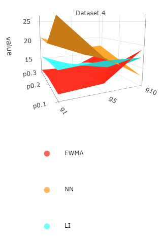
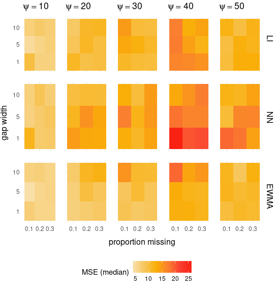

# sophTools
This package contains functions for generating artificial time series, simulating gaps, and interpolating the missing observations, with tools for subsequent analysis and visualization of the interpolators' statistical performance. A detailed analysis facilitated by these code files is provided in my Master's thesis: A Framework for Testing Time Series Interpolators, submitted in May 2020. 

A brief description of the package functionality can be found below.

## Simulating time series data with `simXt()`
Data is generated based on the general model of a time series: the addition of a mean, periodic trend, and noise component.  

## Generating gaps with `simulateGaps()`
Gap structure is defined by two parameters: the proportion of data missing (p), and the gap width (g). 

### Example
* p = [10%, 20%, 30%]
* g = [1, 5, 10]

Under each possible *(p,g)* combination, the function will produce *K* different gap configurations on the original time series.

## Interpolating the gappy data with `parInterpolate()`
Interpolation is performed on the gappy data, using parallel computing for efficiency. The user can choose from a list of 18 built-in interpolators:

| Package | Function | Algorithm name | Abbreviation |
|:--------|:--------------------|:--------------------------------|----------:|
| interpTools | nearestNeighbor() | Nearest Neighbor | NN |  
| zoo | na.approx() | Linear Interpolation | LI |
| zoo | na.spline() | Natural Cubic Spline | NCS |
| zoo | na.spline() | FMM Cubic Spline | FMM |
| zoo  | na.spline() | Hermite Cubic Spline | HCS |
| imputeTS | na_interpolation() | Stineman Interpolation | SI |
| imputeTS | na_kalman() | Kalman - ARIMA | KAF |       
| imputeTS | na_kalman() | Kalman - StructTS | KKSF |
| imputeTS | na.locf() | Last Observation Carried Forward | LOCF |
| imputeTS | na.locf() | Next Observation Carried Backward | NOCB |
| imputeTS | na_ma() | Simple Moving Average | SMA |
| imputeTS | na_ma() | Linear Weighted Moving Average | LWMA |
| imputeTS | na_ma() | Exponential Weighted Moving Average | EWMA |
| imputeTS | na_mean() | Replace with Mean | RMEA |
| imputeTS | na_mean() | Replace with Median | RMED |
| imputeTS | na_mean() | Replace with Mode | RMOD |
| imputeTS | na_random() | Replace with Random | RRND |
| tsinterp | interpolate() | Hybrid Wiener Interpolator | HWI |

or pass in their own functions, so long as its returned value  is a single numeric vector. 

## Evaluating statistical performance with `performance()`
Here, *statistical performance* is defined as some measure that quantifies the overall degree of **deviation** between the original values and the interpolated values.  Performance metrics that are built-in to the package are shown below:

| Criterion | Abbreviation | Optimal |
|:----------|:-------------|:--------|
| Correlation Coefficient | *r* | max |
  | Coefficient of Determination |*r^2* | max |
  | Absolute Differences |  AD  | min |
  | Mean Bias Error |  MBE  | min |
  | Mean Error |  ME  | min |
  | Mean Absolute Error |  MAE  | min |
  | Mean Relative Error |  MRE  | min |
  | Mean Absolute Relative Error |  MARE  | min |
  | Mean Absolute Percentage Error |  MAPE  | min |
  | Sum of Squared Errors |  SSE  | min |
  | Mean Square Error |  MSE  | min |
  | Root Mean Squares |  RMS  | min |
  | Normalized Mean Square Error |  NMSE  | min |
  | Nash-Sutcliffe Coefficient |  RE  | max |
  | Root Mean Square Error |  RMSE  | min |
  | Normalized Root Mean Square Deviations | NRMSD | min |
  | Root Mean Square Standardized Error | RMSS | min |
  | Median Absolute Percentage Error | MdAPE | min |

See `metric_definitions.pdf` in the package files for the mathematical definitions of each performance metric shown above.

## Aggregating the performance metrics within each gap specification with `agEvaluate()`
Statistics are computed on the sampling distribution of the performance metrics across the *K* interpolations in each *(p,g)* gap specification. Below is a list of all the available aggregations:

* mean
* standard deviation
* 0\% quantile (minimum)
* 2.5\% quantile
* 25\% quantile
* 50\% quantile (median)
* 75\% quantile
* 97.5\% quantile
* 100\% quantile (maximum)
* IQR (75\% quantile - 25\% quantile)
* skewness
* p-value of dip test for unimodality

## Visualizing performance as a **surface plot** with `plotSurface()`
A three-dimensional interactive surface is used to visualize the aggregated performance of an interpolator as the structure of the gappy data changes. Through R's interface, the user can interact with the surface plot widgets by manipulating the camera perspective, adjusting the zoom, and hovering over data points for precise numerical information.

*Optimal* performance corresponds to an extreme point on the surface; either a maximum or minimum, depending on the definition of *optimal* (see table of performance criteria above). Multiple interpolations can be compared by layering surfaces on top of one another, where the *best* interpolation for a particular gap structure will be at an extremum at the corresponding *(p,g)* coordinate point.    

The example below shows multiple surfaces layered; each corresponding to a different interpolation method. 

## Visualizing performance as a **heatmap** with `heatmapGrid2()`
When constrained to static visualizations, like when writing papers, heatmaps are more effective at communicating the data. Using `heatmapGrid2()`, a three-dimensional surface can be collapsed into a heatmap through conversion of the third dimension to colour, to which the value of the metric is proportional. 

The heatmap plot below conforms with the surface plot above. 

## Support
Please see the package vignette or email me stmcastel@gmail.com for further assistance.
